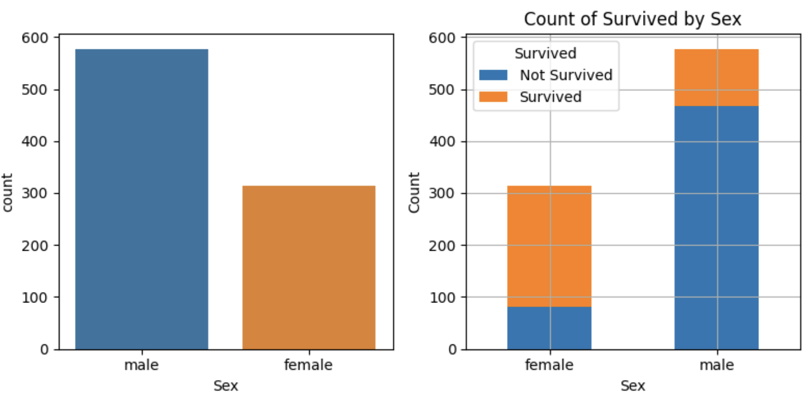
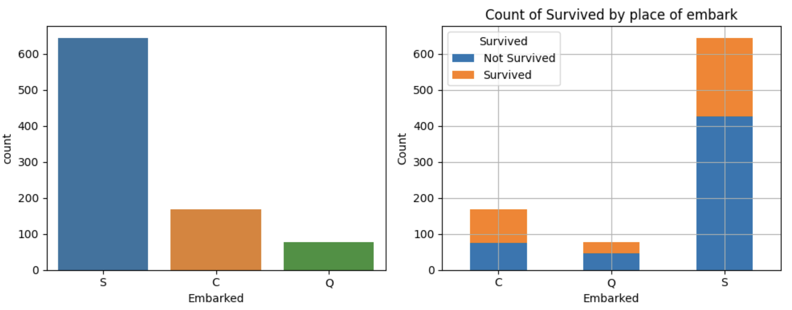
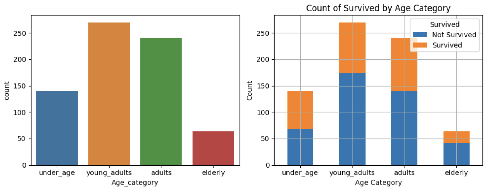
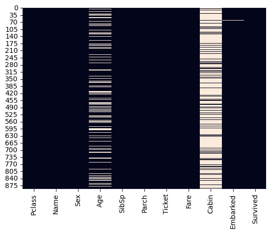
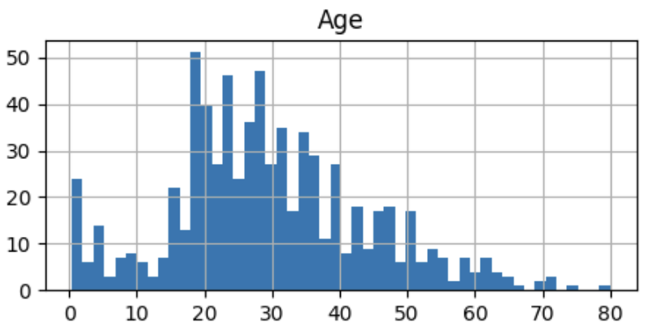
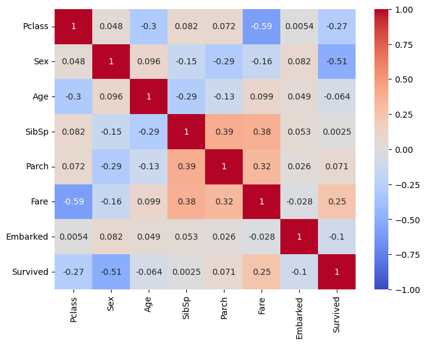

# Kaggle Titanic Challenge
#### Link a colab: https://drive.google.com/file/d/1OGadn6KctRUchMRE9_b9aNZGQQaCxi-1/view?usp=sharing
## **Equipo 4**:
| <h4>Alumno</h4> | <h4>Matricula</h4> |
| ---|---|
| <h5>Mauricio Juárez Sánchez</h5> | <h5>A01660336</h5> |
| <h5>Alfredo Jeong Hyun Park</h5> | <h5>A01658259</h5> |
| <h5>Fernando Alfonso Arana Salas</h5> | <h5>A01272933</h5> |
| <h5>Miguel Ángel Bustamante Pérez</h5> | <h5>A01781583</h5> |

# Reto Kaggle – Titanic classification

El objetivo de este proyecto es resolver el problema Titanic - Machine Learning from Disaster de Kaggle Competition utilizando algoritmos de clasificación. Para ello, se seguirán las siguientes etapas:

## 1. Exploración y preprocesamiento de los datos:

### a. Distribuciones:

- **Verificar si los datos están balanceados en las clases en las cuales se deben separar los datos.**

Para el conjunto de datos del reto **Titanic** nuestra tarea es predecir si un pasajero sobrevivió o no al naufragio. Es decir, las clases objetivo son "sobrevivió" y "no sobrevivió".<br>
Hemos considerado que los datos **NO** están equilibrados ya que el número de muestras de pasajeros que sobrevivieron es mayor al número de muestras de pasajeros que no sobrevivieron. El **porcentage qué 'sobrevivió' [549 personas] es**:  **61.62 %**. El **porcentage of 'no sobrevivió' [341 personas]** es  **38.38%**. <br>

Está verificación del equilibrio de clases es importante para nuestro análisis de datos y la modelización, ya que un desequilibrio significativo puede llevar a problemas de sesgo en los modelos de machine learning. Si una clase está sobrerepresentada en comparación con la otra, el modelo puede tener dificultades para aprender y predecir la clase minoritaria de manera efectiva. Por lo tanto, fue fundamental **evaluar y abordar el desequilibrio de clases en el preprocesamiento** de datos antes de entrenar cualquier modelo.

- **Analizar la distribución de los datos categóricos y su relación con la clase "survived". Comienza a identificar características relevantes para una clasificación precisa.**

Los atributos categóricos son:<br>
| <h4>Atributo</h4> | <h4>Descripción</h4> |
| ---|---|
| <h6>Name</h6> | <h6>Name of passenger</h6> |
| <h6>Sex</h6> | <h6>Sex</h6> |
| <h6>Ticket</h6> | <h6>Ticket number</h6> |
| <h6>Cabin</h6> | <h6>Cabin number</h6> |
| <h6>Embarked</h6> | <h6>Port of Embarkation => C = Cherbourg, Q = Queenstown, S = Southampton</h6> |
<br>
<h4>Atributo 'Sex'</h4><br>
Porcentage of male ( 577 ):  64.76 %<br>
Porcentage of female ( 314 ):  35.24 %<br>
Porcentage of male surviving:  18.89 %<br>
Porcentage of male not surviving:  81.11 %<br>
Porcentage of female surviving:  74.2 %<br>
Porcentage of female not surviving:  25.8 %<br>
<br>

<h4>Atributo 'Embarked'</h4><br>
Porcentage of embark in C = Cherbourg ( 168 ): 18.86 %		Not-Survived:  44.64 %		Survived: 55.36 %<br>
Porcentage of embark in Q = Queenstown ( 77 ):  8.64 %		Not-Survived:  61.04 %		Survived: 38.96 %<br>
Porcentage of embark in S = Southampton ( 644 ):  72.28 %	Not-Survived:  66.3 %		Survived: 33.7 %<br>
<br>

Hemos decidido no utilizar los atributos **'Name'**, **'Ticket'** y **'Cabin'**. Creemos que no aportan una mejora significativa en nuestras predicciones. De hecho, probamos extraer los prefijos *Mr*, *Miss*, *Don*, *Lady*, para analizar si había alguna relación con *'sobrevivir'* o *'no sobrevivir'* pero nos dimos cuenta que dichos prefijos están estrechamente ligados al *'sexo'* de una persona. Es decir, aquellos que tienen prefijos masculinos son hombres y viceversa.<br>


- **Comprender la distribución de los datos numéricos y determinar si es necesario aplicar procesos de normalización o estandarización.**
Los atributos númericos son:<br>
| <h5>Atributo</h5> | <h5>Descripción</h5> |
| ---|---|
| <h6>PassengerId</h6> | <h6>Passenger Id</h6> |
| <h6>Survived</h6> | <h6>Survival	0 = No, 1 = Yes</h6> |
| <h6>Pclass</h6> | <h6>Ticket class	1 = 1st, 2 = 2nd, 3 = 3rd</h6> |
| <h6>Age</h6> | <h6>Age in years</h6> |
| <h6>SibSp</h6> | <h6># of siblings / spouses aboard the Titanic</h6> |
| <h6>Parch</h6> | <h6># of parents / children aboard the Titanic</h6> |
| <h6>Fare</h6> | <h6>Passenger fare</h6> |
<br>
<h4>Atributo 'Age'</h4>
Under age ( 139 ):	     0 - 18 years old	Not-Survived:  49.64 %		Survived: 50.36 %<br>
Young adults ( 270 ):	19 - 30 years old	Not-Survived:  64.44 %		Survived: 35.56 %<br>
Adults ( 241 ):		30 - 50 years old	Not-Survived:  57.68 %		Survived: 42.32 %<br>
Elderly ( 64 ):		50+ years old		Not-Survived:  65.62 %		Survived: 34.38 %<br>
<br>


### b. Datos faltantes:

- **Identificar y visualizar los datos faltantes.**
<br>
Pclass has 0 missing values<br>
Name has 0 missing values<br>
Sex has 0 missing values<br>
Age has 177 missing values<br>
SibSp has 0 missing values<br>
Parch has 0 missing values<br>
Ticket has 0 missing values<br>
Fare has 0 missing values<br>
Cabin has 687 missing values<br>
Embarked has 2 missing values<br>
Survived has 0 missing values<br>


- **Decidir qué características requieren imputaciones y cuáles no. Justificar la decisión y eliminar las columnas no seleccionadas.**

La decisión de qué características requieren imputaciones la tomamos bajo los siguientes criterios:<br>
1. **Age**: Tiene 177 valores faltantes. Dado que la edad podría ser una característica importante para predecir la supervivencia en el contexto del Titanic (por ejemplo, es probable que los niños tengan tasas de supervivencia diferentes a los adultos), creímos razonable imputar estos valores faltantes.

2. **Cabin**: Tiene 687 valores faltantes. Dado que la cantidad de valores faltantes es considerablemente alta, hemos decidido eliminar esta característica en su totalidad. Además, creemos que la información de la *cabina* puede no ser esencial para predecir la supervivencia.

3. **Embarked**: Tiene 2 valores faltantes. Dado que solo hay dos valores faltantes, decidimos imputarlos utilizando la moda (el valor más común) de la característica "Embarked".
<br>

- **Aplicar técnicas de imputación para los datos faltantes. Seleccionar la mejor técnica y justificar la elección.**

Usamos la técnica incluída en scikit learn para realizar imputaciones.<br>
```from sklearn.impute import SimpleImputer```<br>
Para los valores numéricos usamos:<br>
```imputer_num = SimpleImputer(strategy="median")```
Para los valores categóricos usamos:<br>
```"imputer_cat = SimpleImputer(strategy="most_frequent")```

Usamos la mediana porque es una medida de tendencia central robusta que no se ve afectada por valores extremos o atípicos. En el caso de "Age", podría haber valores atípicos que afecten la media, es por eso que la mediana fue nuestra elección más robusta para imputar los valores faltantes.

Observamos que la distribución de "Age" es asimétrica pero *NO* contiene valores atípicos significativos. Aun así, creímos preferible utilizar la mediana para evitar la influencia de estos valores atípicos en la imputación. Además, dicha asimetría no es muy significativa, dado que la desviación estándar es de 14. A continuación presentamos una gráfica que refleja la distribución de esta categoria numérica:<br>
<br><br>

Por otro lado, para la categoría 'Embarked' únicamente imputamos 2 valores. Decidimos usar la estrategia de reemplazo por el valor **más frecuente** también conocida como la **moda**, está decisión se tomó para seguir la tendencia central y dar una distribución concisa a la categoría.<br>


### c. Análisis de correlación:

- **Realizar un análisis de correlación para decidir qué características deben mantenerse y cuáles descartarse.**

El resultado del análisis de correlación dio la siguiente figura:<br>
<br>

Con base en esta figura vemos que el rango de valores va de -1 a 1. *-1* indica que hay una fuerte correlación **negativa**. *0* nos indica que no hay correlación. *1* nos indica que hay una fuerte correlación **positiva**.

1. **Survived**:
   - Su correlación con otros atributos es lógicamente de gran interes: 
     - Hay correlación positiva con Fare (0.247519).
     - Hay correlación negativa con Pclass (-0.268318) y Sex (-0.509660).

2. **Pclass**:
   - Su correlación con 'Fare' y 'Age' fue como sigue:
     - Correlación negativa con Fare (-0.594245).
     - Correlación negativa con Age (-0.304298).
   - El hecho de que esté correlacionada con otras 2 clases / atributos, nos pareció como un atributo robusto para las predicciones.

3. **Sex**:
   - Tuvo una fuerte correlación negativa con 'Sobrevivió' (-0.509660), asi que la mantuvimos pues creímos que es un predictor significativo.

4. **Age**:
   - Tiene una correlación negativa con Pclass (-0.304298). Decidimos agrupar Age en categorías para mejorar la distribución y asemejarla más a una campana gaussiana. Sin embargo, vemos que su correlación con otros atributos no es tan fuerte como lo hubieramos pensado en un inicio. No es un atributo que tenga gran significado en las predicciones.

5. **SibSp**:
   - Tiene una correlación positiva con Parch (0.392197). Este atributo decidimos combinarlo con Parch para la creación de un nuevo feature llamado 'Travel Alone'. El objetivo fue identificar a los pasajeros que viajaron junto a su familia y aquellos pasajeros que viajaron solitariamente. Creemos que este factor puede ser un buen predictor de supervivencia. 

6. **Parch**:
   - Mismo caso que SibSp.

7. **Fare**:
   - *Fare* es un atributo interesante porque tiene correlaciones negativas fuertes con 'Pclass' (-0.594245) y correlaciones positivas con 'Survived' (0.247519) y moderadamente correlacionada con otros atributos.

8. **Embarked**:
   - No tiene correlaciones fuertes pero decidimos quedarnoslo como una versión de prueba. Sin embargo, también optamos por eliminarlo para probar nuestros modelos en una segunda iteración.

### d. Transformación de datos:

- **Convertir los datos categóricos en numéricos. Explorar diferentes métodos y seleccionar el más adecuado. Justificar la elección.**

Para la transformación de los datos usamos el siguiente codificador:<br>
```from sklearn.preprocessing import OneHotEncoder```
```onehot = OneHotEncoder(handle_unknown="ignore")```

La elección de codificación estuvo entre **OneHotEncoder** y **Codificación por enteros** (por ejemplo, [0, 1, 2]) para variables categóricas. Tomamos nuestra decisión basándonos en los modelos que ibamos a usar, concluímos que la mejor estrategia sería usar *OneHotEncoder*

**1. Regresión Logística:**: Usualmente, la codificación one-hot es una mejor opción para la regresión logística. Esto se debe a que la regresión logística no asume ninguna relación ordinal inherente entre las categorías, y la codificación one-hot garantiza que cada categoría se trate como una característica binaria separada.

**2. Clasificador de Bosque Aleatorio (Random Forest):**

   - **Elección de Codificación:** Los bosques aleatorios pueden funcionar bien tanto con codificación one-hot como con codificación entera. Los bosques aleatorios son robustos y pueden manejar la codificación ordinal si hay un orden significativo. Sin embargo, si deseas evitar posibles interpretaciones erróneas de la ordinalidad, la codificación one-hot es una elección más segura. A menudo es más fácil comenzar con la codificación one-hot y ver si funciona bien para tu conjunto de datos específico.

**3. Clasificador de Vecinos Más Cercanos (KNN):**

   - **Elección de Codificación:** KNN es un algoritmo basado en la distancia y puede ser sensible a la elección de la codificación. En la mayoría de los casos, se recomienda la codificación one-hot para KNN porque trata cada categoría como una dimensión separada. Sin embargo, si tienes datos ordinales y estás seguro de la significatividad del orden, podrías experimentar con la codificación entera.

**4. Clasificador de Máquinas de Soporte Vectorial (SVM):**

   - **Elección de Codificación:** Las SVM pueden trabajar con codificación one-hot y codificación entera. Depende del kernel que elijas y la naturaleza de tus datos. Los kernels lineales suelen funcionar bien con la codificación one-hot, mientras que las funciones de kernel como la Función de Base Radial (RBF) pueden manejar ambos tipos de codificación. Nuevamente, la codificación one-hot es una elección más segura si tienes dudas.

En resumen, la codificación one-hot es una opción segura y ampliamente utilizada para la mayoría de los algoritmos de aprendizaje automático, ya que garantiza que cada categoría se trate como una característica separada, dejando claro que no existe una relación ordinal inherente. Sin embargo, si tienes un conocimiento experto sólido que sugiere que la codificación entera es apropiada, puedes probarla y ver cómo se desempeña tu modelo. Siempre considera las características específicas de tus datos y experimenta con diferentes estrategias de codificación para determinar la mejor aproximación para tu problema.

## 2. Clasificación:

### a. Selección de clasificadores:

- **Elegir tres algoritmos de clasificación que se utilizarán en el proyecto. Justificar la selección de cada algoritmo.**

Usamos los siguientes 4 modelos de clasificación:<br>
| <h4>Modelo</h4> | <h4>Breve descripción</h4> |
| ---|---|
| <h6>Logistic Regression</h6> | <h6></h6> |
| <h6>K Nearest Neighbors</h6> | <h6></h6> |
| <h6>Support Vector Machine</h6> | <h6></h6> |
| <h6>Random Forest Classifier</h6> | <h6></h6> |

### b. Train-test-validate split:

- **Utilizar k-cross validation para realizar la clasificación. Seleccionar el valor de "k" y justificar la elección.**

### c. Métricas de evaluación:

- **Calcular la exactitud, precisión, matriz de confusión, curva ROC y AUC. Explicar cada una de estas métricas.**
- **Con base en estas métricas, determinar el mejor clasificador y justificar la elección.**


